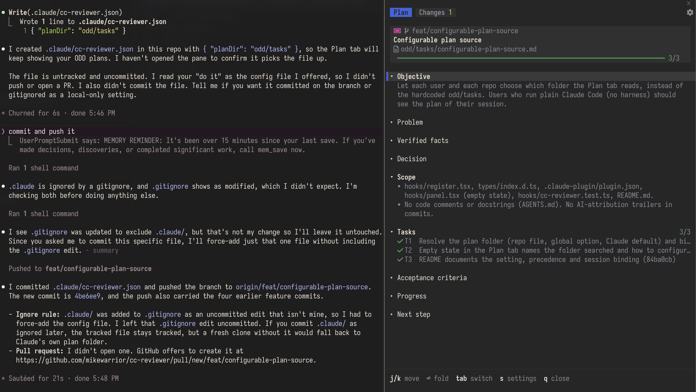

# cc-reviewer

A Claude Code mod (plugin id `cc-reviewer`): a side pane with two tabs.



- **Plan** shows the plan markdown of your session as collapsible sections, with task progress and the running task's elapsed time.
- **Changes** shows git changes grouped as Commits (ahead of upstream), Staged, Unstaged and Untracked, with `+/−` stats. Expand a commit or a file to read its diff right under the row: `+` lines in green, `-` lines in red, hunk headers in cyan and file headers dim. Long diffs stop after 200 lines with a note counting the rest.

Three layouts (**Outline**, **Powerline**, **Focus**) and an optional Nerd Font icon set are chosen in the settings menu. The choice is saved between sessions. Colors use ANSI slots, so the pane follows your terminal theme.

## Plan source

The Plan tab reads Markdown files from one folder. The folder is the first of these that is set:

1. `planDir` in `.claude/cc-reviewer.json` in the project.
2. The `planDir` plugin option, which applies to every project.
3. Claude's own plan folder: the `plansDirectory` setting if you set one, otherwise `~/.claude/plans`.

The repo file looks like this. The folder is relative to the project, or absolute.

```json
{ "planDir": "odd/tasks" }
```

The plugin option is a text field in the plugin's config menu (`planDir`). Leave it empty to skip it. A repo file that is missing, is not valid JSON or has an empty `planDir` is ignored.

Which file the pane shows, first match wins:

1. The plan file of this session, when plan mode starts and reports it.
2. The file this session last read, wrote or edited in the folder.
3. The file you last used on the current git branch, remembered per project and branch. A new session on the same branch picks it up again.
4. A file named after the branch: its name equals the branch name or the last part after `/` (`feat/foo` finds `foo.md`), or it starts with the same ticket id (`feature/ABC-123-login` finds `abc-123-login.md`). The most recently modified one wins.

There is no newest-file fallback, so a leftover plan from another session or branch is never shown. On `main` and `master` only 1 and 2 apply, and nothing is remembered for them. Without a git branch (detached HEAD or no repository) 3 and 4 are skipped. The shared `~/.claude/plans` folder holds plans from all your projects, so the same rules keep other projects' plans out of the pane.

When no plan is found for the session or branch, the Plan tab says which folder it looked in and how to set `planDir`.

## Plan file format

Plan files are Markdown.

```markdown
# PROJ-1 - Example feature

## Objective

What and why.

## Tasks

- [x] T1: Done task
      Indented lines under a task show when you expand it.
- [ ] T2: Next task
```

- The first `# ` line is the title and every `## ` section becomes a collapsible block.
- Only the `## Tasks` section gets task rows. Other sections are drawn as rendered Markdown.
- The first unchecked task counts as the running one, unless a task is marked `[~]`, `[>]` or `[/]`. Its elapsed time counts from when the pane first saw it running.

## Install

Requires a Claude Code build with plugin mods (the `plugin-authoring` skill).

Clone this repository, then start Claude Code with the folder as a plugin directory.

macOS / Linux:

```bash
claude --plugin-dir /path/to/cc-reviewer
```

Windows (PowerShell):

```powershell
claude --plugin-dir C:\path\to\cc-reviewer
```

You can also set `CLAUDE_CODE_PLUGIN_DIRS` to a list of plugin folders (separated by `:` on macOS and Linux, `;` on Windows).

Open the pane with `/cc-reviewer`. It also opens by itself on terminals 144 columns wide or more.

## Use

Click the pane to give it keyboard focus. Escape hands the focus back to the prompt.

| Key | Action |
| --- | --- |
| `j` / `↓`, `k` / `↑` | Move the cursor |
| `g` / `G` | Top / bottom |
| `Enter` / `Space` | Fold or unfold the current section or group, or expand or collapse the diff of a commit or file (on a child row, its parent) |
| `h` / `←`, `l` / `→` | Collapse / expand |
| `Tab`, `1`, `2` | Switch tab |
| `s` or `,` | Open settings (`s`, `,` or `q` closes it) |
| `q` | Close the pane |

Tabs, rows and the gear icon also respond to a mouse click.

The pane re-reads the plan file and `git` every few seconds and after every Read, Write, Edit and Bash call. Diffs are fetched only when you expand a row, and the refresh then re-runs git for the open diffs alone. Folders in the Untracked group have no diff.

## Develop

```bash
claude plugin validate .
claude plugin test .
```

The tests mock the file system and `git` through the engine, so they need neither a repository nor plan files.

## License

Apache License 2.0. See [LICENSE](LICENSE).
